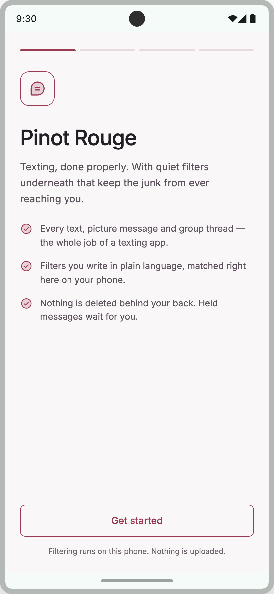
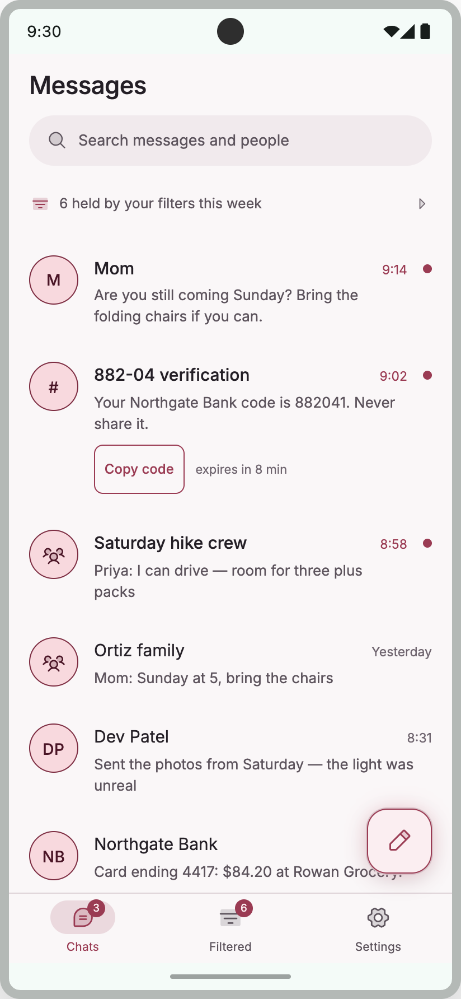
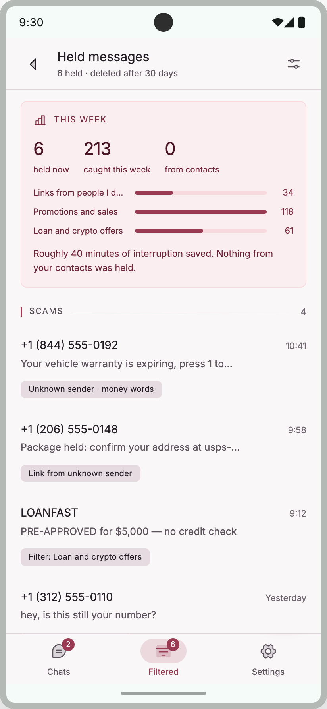
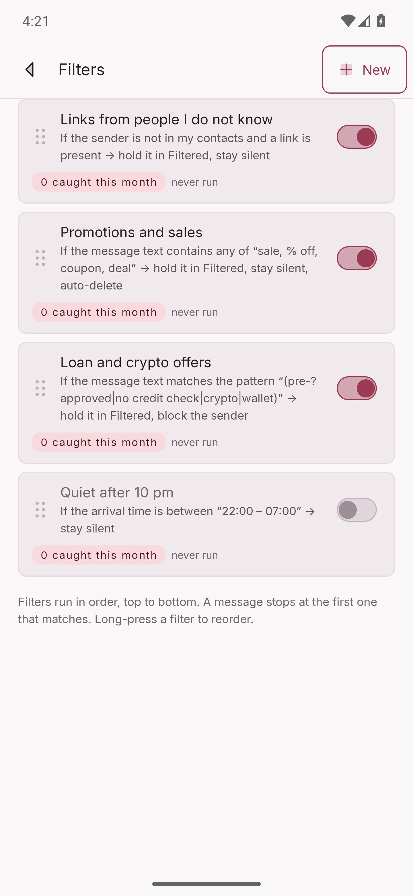
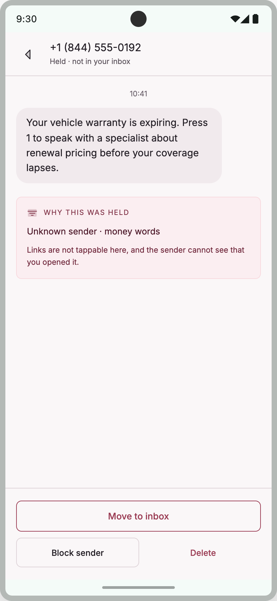
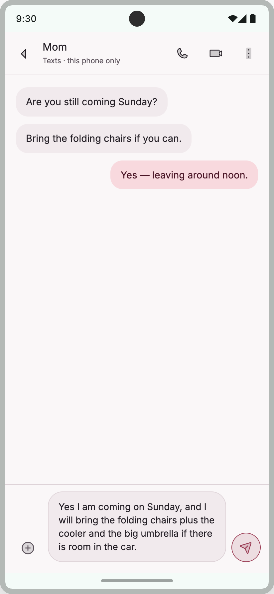
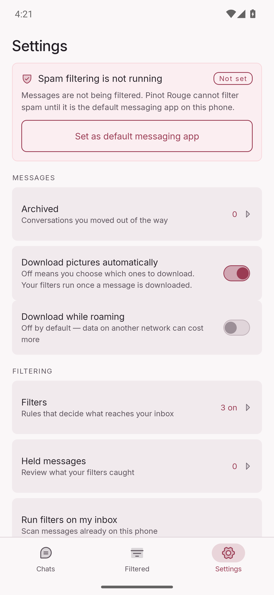
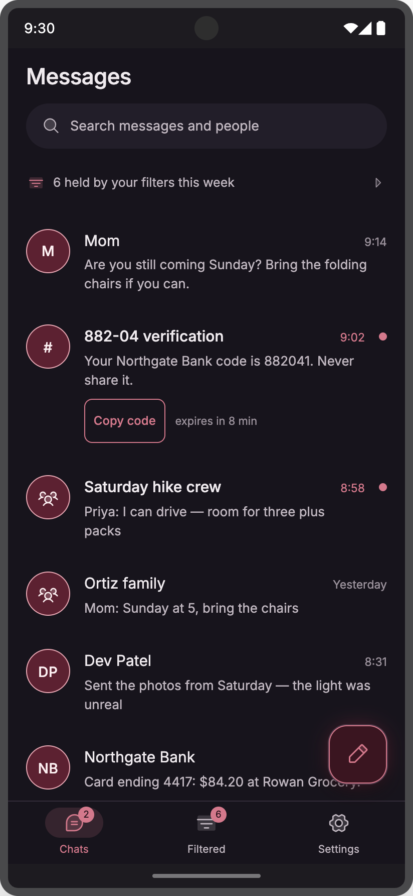
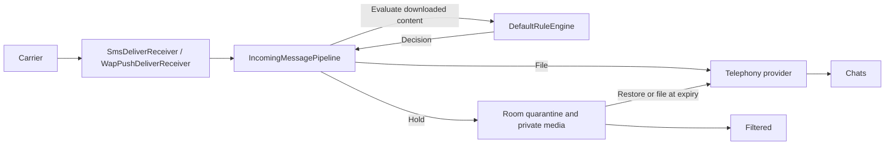

<p align="center">
  
</p>

<h1 align="center">Pinot Rouge</h1>

<p align="center">
  <strong>An Android SMS/MMS app with spam filters you build yourself, explained in plain language and evaluated on your phone.</strong>
</p>

<p align="center">
  Keep conversations in Chats and unwanted messages in Filtered, with a reason you can inspect.
</p>

<p align="center">
  
  
  
  
</p>

<p align="center">
  
  
  
</p>

<p align="center">
  <em>Screenshots are demonstration data (prototype copy and emulator starter filters), not captures of a real personal inbox. See <a href="docs/readme/README.md">docs/readme/README.md</a>.</em>
</p>

---

## Why it exists

Pinot Rouge makes spam filtering something you can inspect and change. **You decide what matches, what happens to it, and which senders to trust.**

Build rules such as “unknown sender and a link” or “text contains sale, coupon, deal.” The rule builder turns your selections into a sentence you can check before saving. Rules run locally on incoming SMS and downloaded MMS. Messages caught by a hold rule wait in **Filtered**, with the reason in plain English.

The app takes Android’s **default SMS role** so it can decide whether to write an incoming message into Android’s shared message store or keep it in private quarantine. Chats, group conversations, search, notifications, and picture messaging sit around that filtering system.

**Current status:** development MVP, version `0.1.0`, for Android 13 and newer. This README describes implemented features and their limits. Emulator tests alone do not establish that a picture sends on a particular carrier; that still needs real-network verification.

**Retention matters:** held messages normally move into Android’s store as already-read after their hold window, which defaults to 30 days. A rule with **Auto-delete** instead deletes them at expiry. The **Promotions and sales** starter filter is selected by default and uses a **14-day auto-delete** window. Review the starter choices during onboarding; see [what happens to filtered messages](#what-happens-to-filtered-messages).

There is **no app backend, account, telemetry, or ML classifier**. Filtering uses explicit rules. Sending and receiving SMS/MMS still uses your carrier; on-device filtering does not make messaging an offline service.

---

## Screens

<p align="center">
  
  
</p>

<p align="center">
  <em>Left:</em> filters as English sentences, first-match-wins, drag to reorder.<br>
  <em>Right:</em> a held message — why it was caught, then Move to inbox / Block / Delete.
</p>

<p align="center">
  
  
  
</p>

---

## Features

### Filters you can read

Rules are built from fields, operators, and actions — then rendered back as a sentence you can check before saving.

| You can match on | Examples |
|---|---|
| **Sender** | not in my contacts · is this number · starts with an area code · is a short code |
| **Text** | contains any of these words · does not contain · matches a regex |
| **Link** | any URL · known URL shortener · on a specific domain |
| **Time** | between 22:00 and 07:00 (wraps midnight) · weekend |
| **Attachment** | has a photo |

Match **all** conditions or **any**. The first matching enabled rule wins. Actions include **Hold in Filtered**, **Stay silent**, **Auto-delete** after the hold window, **Block sender**, and **Mark as read**. Holding suppresses the app’s arrival notification; silencing without holding leaves the message in Chats.

The contact exemption is on by default and bypasses rule matching for known contacts. An explicitly blocked sender is checked before that exemption. Rules containing conditions this build cannot read remain inactive and open read-only, so editing cannot silently drop an unknown condition.

The builder **backtests** a draft against recent inbox texts: “this would have caught *n* of your last *m* texts.” You can also **run filters on the existing inbox** (a sweep) without waiting for the next arrival. Both currently sample **received SMS**, not sent texts or MMS; a photo rule’s backtest does not measure how many picture messages it would catch.

Onboarding offers four starter filters. Unknown-sender links, promotions, and loan/crypto patterns are selected by default; quiet hours is off. You can change those choices before completing setup. The promotions rule includes auto-delete, and the loan/crypto rule also blocks matching senders.

### What happens to filtered messages

Held messages live in a private Room database, with held photos in app-private files. They are kept out of Android’s shared SMS/MMS store until restored or filed at expiry.

| Event | Result |
|---|---|
| A hold rule matches | Keep the message and its media in Filtered, without an arrival notification. |
| Move to inbox | Restore into Android’s store, then remove the private held copy. Arrival holds become unread; swept texts retain their original read state. |
| Delete a held message | Permanently remove that held message and its media. |
| Block sender from a held message | Remove that held message and block the sender; future arrivals from the blocked sender are held for review. |
| Hold expires without Auto-delete | The daily job files the message as already-read. Failed writes remain held for retry. |
| Hold expires with Auto-delete | The daily job permanently removes the message and its media. |
| Delete a filter | Keep messages it already held and their recorded reasons. |

Expiry processing uses the rule’s current Auto-delete setting. If that rule has been deleted, its held messages are filed as already-read at expiry. Blocking is local to Pinot Rouge; it does not stop a sender transmitting messages.

Private quarantine controls where Pinot Rouge stores messages. It does **not** guarantee that no other permitted app can observe an incoming SMS: Android also exposes the separate [`SMS_RECEIVED` broadcast](https://developer.android.com/reference/android/provider/Telephony.Sms.Intents#SMS_RECEIVED_ACTION).

### Everyday messaging

- Conversation list with search, archive, and category chips
- 1:1 and group threads using SMS and MMS, with older history available to load
- Compose and send text or one staged camera/gallery photo, with compression to fit the MMS size limit
- Received-photo grids and a full-screen photo view
- Picture auto-download controls; on by default, with downloading while roaming off
- Notifications with MessagingStyle; one-tap copy for OTP codes, then a best-effort clipboard clear
- Preview mode if you decline the SMS role: edit filters and browse history where read permission is granted; sending and arrival filtering require the role
- Nine accent themes (Cabernet, Rosé, Concord, …) plus an in-app dark theme

MMS filters run **after download**. With auto-download off, an undownloaded message appears in Chats with a Download action and no arrival notification. It may move to Filtered after its content is downloaded and evaluated.

### Current limits

- Outgoing attachments are limited to **one photo per message**. Video, file, contact, location, and dedicated GIF attachments are not implemented.
- The photo viewer opens individual pictures; swipe, Save, and Share remain planned work.
- There is **no RCS implementation**, RCS media queue, typing indicator, or read-receipt support. Future design ideas are not current app features. Android’s RCS single-registration APIs require privileged access and carrier certification; becoming the default SMS app is insufficient. See [Android’s RCS requirements](https://source.android.com/docs/core/connect/ims-single-registration).
- There are no accounts, cloud sync, cloud backup, or ML classification.

### Privacy and data ownership

| Surface | What happens |
|---|---|
| Filtering | Runs locally. No app HTTP client, analytics SDK, or crash-reporting service. |
| Messaging transport | SMS/MMS goes through Android and the carrier. MMS send/download uses `SmsManager`, including carrier network traffic. |
| App Auto Backup | Disabled in the manifest. This policy covers Pinot Rouge’s private data, not Android’s shared message store or other apps’ backup settings. |
| Device-to-device transfer | The Room database and its journal files, DataStore, and held media are excluded. |
| Contacts | Read for names and the “never filter contacts” check. Not copied into Room. |
| Held photos | Stored as received, including any embedded metadata such as location. |

Messages already filed in Android’s store can be read by another SMS app with the appropriate permissions. Private filters and held messages are not automatically transferred to another app or phone. Clearing Pinot Rouge’s app data or uninstalling it removes that private data.

---

## How it was made

The UI was designed **before** the Kotlin: warm paper surfaces, wine accent, and outline primary buttons. Intentional departures from that design (for example the match-all / match-any chip pair in the rule builder) are implemented in the app you see here.

The filter engine is a **pure Kotlin/JVM module** with no Android on its classpath, so “the engine must not grab a `Context`” is a compile error. Callers pass an `EvaluationContext` in. Engine tests run in a few seconds with no emulator.

The Android shell is a default SMS handler: receive → download if needed → evaluate → hold or file → notify when appropriate. Incoming SMS and MMS share one pipeline. Outgoing SMS uses platform sent-result callbacks; MMS uses Android’s `SmsManager` to communicate with the carrier’s multimedia messaging service.

Work is organized in small pull requests with a local merge gate and an instrumented suite on Android 13 and 16 emulators. The [CI workflow](.github/workflows/ci.yml) runs unit tests, compiles instrumented tests, and builds the debug APK; it does not execute the instrumented suite.

---

## Architecture

```
:core:rules     Pure JVM. Rule, Condition, DefaultRuleEngine.
                evaluate / summarize / plainWords / backtest.
                No android.* imports.

:app            Default SMS handler and UI.
```



| Package | Responsibility |
|---|---|
| `sms/` | Role, receivers, send path, `IncomingMessagePipeline` |
| `data/telephony/` | Android’s message store (SMS + MMS parts) |
| `data/repo/` | Rules, quarantine, threads, archive |
| `data/room/` | Held bodies, blocklist, stats — private |
| `data/prefs/` | Settings over DataStore |
| `ui/` | Compose screens: one ViewModel, one `StateFlow` of UI state |
| `work/` | Daily commit of expired holds; weekly digest |
| `notify/` | Channels, MessagingStyle, sensitive OTP clipboard |

**Storage responsibility.** While Pinot Rouge holds `ROLE_SMS`, it is responsible for persisting incoming SMS. It must either write the message into Telephony or retain it privately. The role requires four manifest components: `SMS_DELIVER`, `WAP_PUSH_DELIVER`, `SENDTO`, and `RESPOND_VIA_MESSAGE`.

The engine returns a decision; it does not call Android repositories or write messages itself. The pipeline applies that decision. Screens accept state and callbacks, route composables connect ViewModels, and Hilt supplies dependencies. Provider and disk I/O belong on `Dispatchers.IO`.

---

## Stack

| Layer | Choice |
|---|---|
| Language | Kotlin |
| UI | Jetpack Compose, Material 3 with a fully replaced Pinot theme (no dynamic color) |
| DI | Hilt |
| Persistence | Room + DataStore |
| Async | Coroutines / Flow |
| Background | WorkManager |
| Min / target SDK | 33 / 36 (`compileSdk` 37) |
| Package | `com.pinotrouge.messaging` |

Build versions are defined in [the version catalog](gradle/libs.versions.toml), [the Gradle wrapper](gradle/wrapper/gradle-wrapper.properties), and [the app configuration](app/build.gradle.kts).

---

## Repository layout

```
app/                 Android application
core/rules/          Filter engine (pure Kotlin)
docs/readme/         Screenshots used on this page (synthetic / emulator)
docs/PRIVACY.md      What the implementation actually stores
docs/THREAT_MODEL.md Working threat model
```

Start with this README, then [CONTRIBUTING.md](CONTRIBUTING.md) and [AGENTS.md](AGENTS.md) for how to change the code. Privacy behaviour is in [docs/PRIVACY.md](docs/PRIVACY.md). How to report a vulnerability is in [SECURITY.md](SECURITY.md).

---

## Building

### Prerequisites

- JDK **21**, matching CI. The app and rules module target Java 17 bytecode.
- Android SDK platform **37** and the SDK tools required by the build.
- The checked-in Gradle wrapper; a separate Gradle installation is unnecessary.
- Set the SDK location through Android Studio, `sdk.dir` in gitignored `local.properties`, or `ANDROID_HOME`.

### Debug build and merge gate

From the repository root:

```bash
ANDROID_SERIAL=pinot-no-device ./gradlew \
  :core:rules:test :app:testDebugUnitTest \
  :app:compileDebugAndroidTestKotlin assembleDebug
```

This gate needs no connected device. It compiles, but does not run, instrumented tests. The debug APK is written to `app/build/outputs/apk/debug/app-debug.apk`.

Enable the repository hooks once per clone:

```bash
git config core.hooksPath .githooks
```

### Device testing

Run instrumented tests only on an explicitly selected, idle emulator:

```bash
ANDROID_SERIAL=emulator-XXXX ./gradlew :app:connectedDebugAndroidTest
```

Replace `emulator-XXXX` with the serial verified against the intended AVD name. Follow [AGENTS.md](AGENTS.md) for device selection, role setup, and cleanup. The suite changes the default SMS role and installs/uninstalls the app. **Do not target a personal phone or run an unpinned device suite.** If you run the instrumented suite, cover Android 13 and Android 16 emulators and report pass/skip counts per device.

To use arrival filtering, set Pinot Rouge as the **default SMS app**. Without the role, rule editing is available, and browsing/backtesting depends on read permission; incoming messages are handled by the current default app.

### Release signing

Release builds require these keys in gitignored `local.properties`: `pinot.keystore`, `pinot.keyAlias`, `pinot.keystorePassword`, and `pinot.keyPassword`. Use an absolute keystore path to avoid ambiguity. Never commit that file or signing material.

The release build fails when signing configuration is missing; it will not fall back to the debug keystore. This repository provides source to build and sideload, rather than a Play Store installation link.

---

## License

Application source is dedicated to the public domain under [The Unlicense](LICENSE).

The bundled Inter font remains under the [SIL Open Font License](licenses/Inter-OFL.txt). See [NOTICE.md](NOTICE.md).
